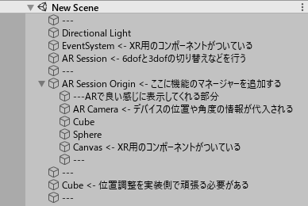

<style type="text/css">
  .reveal h1,
  .reveal h2,
  .reveal h3,
  .reveal h4,
  .reveal h5,
  .reveal h6 {
    text-transform: none;
  }
</style>

# ARFoundationの座標移動について

yusuke-ota

---

## 初めに

本LTはUnityのARFoundationを使ったことがない人～ちょっと触ってみた人向けです。

---

## 自己紹介

--

@yusuke-ota(github)  
アマチュアプログラマー

言語: Rust、C#(Unity)、Ruby、C++

サーバ(Rust)勉強中

**最近困っていること**  
Twitterを始めたが何を書けばいいかわからない

---

## 目次

* ARFoundationて何
* ARFoundationでのオブジェクトの親子関係
* ARFoundation等での位置合わせ機能一覧
* 各機能のメリットデメリット、使い分け
* まとめ

---

## ARFoundationて何

--

### デバイスとAR SDK

|デバイス|AR SDK|
|:--:|:--:|
|iPhone|ARKit SDK, ARCore SDK|
|Android端末|ARCore SDK|
|Magic Leap|Lumin SDK|
|HoloLens|Windows 10 SDK|

--

これらを共通の関数から扱うことができる機能

※Magic Leap、HoloLensは **ARFoundation 4.x** から

---

## ARFoundationでのオブジェクトの親子関係

--

### プロジェクトビュー



--

## 概略図



---

## ARFoundation等での位置合わせ機能一覧

---

### 一覧

```C#
// 普通のUnityEnginのGameObject.Transform
// 座標を入れたり回転させたり思うがまま
GameObject.Transform = Transform
```

```C#
// 指定したARSession内のオブジェクトを、
// 指定した場所(Vector3)、指定した角度(Quaternion)になるように
// ARSessionOriginを移動する(ここ重要)
ARSession.MakeContentAppearAt(GameObject, Vector3, Quaternion)
```

```C#
// 画像を認識した際に、画像の位置にプレハブのインスタンスを生成する
// 初回以降はARTrackedImageManager.trackedImagesChangedに
// イベントを登録してゴリゴリする
ARTrackedImageManager.trackedImagePrefab = GameObject
```

---

## 各機能のメリットデメリット

--

### ARSession.MakeContentAppearAt(省略)

* +実装側で計算する必要がないので楽
* -ARSessionOrigin(1つしかない)を移動させるので、  
  現実のある点と1対1対応でなければならない

**例**

* OK: 固定メインディスプレイの横にメモを表示させる(1対1)
* NG: すべてのディスプレイの横にメモを表示させる(n対n)

--

### GameObject.Transform

* +ARSessionは固定するので、  
  処理の許す限り対応付けられる
* -入れ子のオブジェクトの回転を扱うようになると、  
  Quaternionで頭がおかしくなって死ぬ

--

### ARTrackedImageManager.trackedImagePrefab

* +簡単なものであれば、エディタ上で実装できる
* +位置が決まっていない物体に対して、
  位置合わせをすることができる
* -駆動するのに対応する画像を設定する必要がある
* -アプリ起動中に移動する物体は対応できない  
  (ARTrackedImageManager.trackedImagesChangedを使う)

---

## 各機能の使い分け

アクティブな位置合わせ箇所が1つ  
=> ARSession.MakeContentAppearAt(GameObject, Vector3, Quaternion)

アクティブな位置合わせ箇所(固定)が1つ以上で、対応する画像がある  
=> ARTrackedImageManager.trackedImagePrefab

それ以外  
=> GameObject.Transformを使って自力実装

---

## まとめ

* ARFoundation便利
* オブジェクトの親子関係が独特なので注意
* 複数か所and位置固定のポイントで位置合わせする場合は画像追跡を使おう
* Transformを直接いじるのは最後の手段
