<style>
grid-container {
    height: 100%;
    display: grid !important;
    grid-template:
        "header header  header header" 100px
        " ...    lead    lead   ...  " 150px
        " ...    main    main   ...  " 1fr
        " ...    footer footer  ...  " 50px
        / 50px     1fr    1fr   50px;
}

/* hタグはデフォルトで見出し */
[data-markdown] > h1, [data-markdown] h2,
[data-markdown] > h3, [data-markdown] > h4,
[data-markdown] > h5 {
    grid-area: header;
}
/* pタグはデフォルトでリード文 */
[data-markdown] > p {
    grid-area: lead;
}
/* ulタグはデフォルトでメイン */
[data-markdown] > ul {
    grid-area: main;
}
lead { grid-area: lead; }
main { grid-area: main; }
left {
    grid-area: 3 / 2;
    font-size: 0.8em !important;
}
right {
    grid-area: 3 / 3;
    font-size: 0.8em !important;
}
footer {
    text-align: left;
    font-size: 0.5em !important;
    grid-area: footer;
}
full { grid-area: 2/1/ 4/5; }

li ul {
    font-size: 0.8em !important;
    margin-bottom: 10px !important;
}

/* h5, h6は画像などの見出し用に */
reveal h5 { font-size: 0.6em; }
reveal h6 {
    padding-left: 2em;
    padding-right: 2em;
    font-weight: bolder;
    text-align: left;
    font-size: 0.6em;
}
</style>

<style type="text/css">
  .reveal h1,
  .reveal h2,
  .reveal h3,
  .reveal h4,
  .reveal h5,
  .reveal h6 {
    text-transform: none;
  }
</style>

# UnityのWebRTC機能を触ってみた

---

## WebRTCって

(ざっくり)  
ブラウザで低遅延P2P通信できる  
動画ストリーミング技術

---

## 公式サンプルを動かした動画

<video autoplay loop controls height="500"><source src="./image_for_webrtc/webrtcサンプル.mp4"></video>

---

## 速度比較


画像引用:<https://www.dpsj.co.jp/tech-articles/low-latency>

---

## WebRTCのデメリット

P2Pで通信を行う
=> 人数が増えるとコネクション数がすごいことになる

--


--


--



---

## 対処法

SFUを使う
(間に配信用のサーバを噛まそう)


---

## Unity WebRTCの機能


リモートクライアント -> Unityに動画、音声がない
[今年中実装予定らしい](https://forum.unity.com/threads/unity-render-streaming-introduction-faq.742481/page-8#post-6074178)

---

## サンプル

* [GitHubのUnity公式リポジトリ](https://github.com/Unity-Technologies/UnityRenderStreaming)からgit clone  
* Unityパッケージマネージャーからインポート(**こっちがおすすめ**)


---

## 導入

日本語のドキュメントを読むと良いです  

[UnityRenderStreamingチュートリアル](https://github.com/Unity-Technologies/UnityRenderStreaming/blob/develop/com.unity.renderstreaming/Documentation~/jp/tutorial.md)

---

## 改造したい人向け

* Unity側のリモート入力のパース関係:  
  テンプレートのRemoteInput.cs  

* JavaScript側の入力のパース関係:  
  GitHubのUnity公式リポジトリの  
  [register-events.js](https://github.com/Unity-Technologies/UnityRenderStreaming/blob/ef41b83d0334a055c7158038b948fa04d887ee19/WebApp/public/scripts/register-events.js)  

* ブラウザに表示するボタン関係:  
  GitHubのUnity公式リポジトリの  
  [app.js](https://github.com/Unity-Technologies/UnityRenderStreaming/blob/release/2.0.2/WebApp/public/scripts/app.js)の50行目~93行目あたり

---

<!-- WebXRでデバイスの角度とか取ってリモートレンダリングっぽさをもっと出したい httpsが面倒だけど
https://codelabs.developers.google.com/codelabs/ar-with-webxr-ja/#3 -->

## ちょっといじってみる

---

## モデルインポート


---

## ブラウザのボタン変更

app.jsのボタン実装部分を書き換える

```js: app.js
// add original button
const elementOriginalButton = document.createElement(`button`);
elementOriginalButton.id = "originalButton";
elementOriginalButton.innerHTML = "AnimationOnOff";
playerDiv.appendChild(elementOriginalButton);
elementOriginalButton.addEventListener("click", function(){
  sendClickEvent(videoPlayer, 3);
});
```

--

style.cssのボタン部分を書き換える

```css
#originalButton{
    position: absolute;
    bottom: 10px;
...省略
}
```

--


---

## Unityのイベント割り当て

アニメーションOn/Off切り替えスクリプト作成

```C#
public void OnPushButton()
{
    switch (_isAnimationPlaying)
    {
        case true:
            _playableDirector.Pause();
            _isAnimationPlaying = false;
            break;
        case false:
            _playableDirector.Resume();
            _isAnimationPlaying = true;
            break;
    }
}
```

--


---

## 送受信するメッセージを変更

ブラウザ側メッセージを変更する

--

Unity側メッセージを変更する

--

<!-- todo:動画追加 -->

---

## まとめ

* WebRTCでブラウザ間で直接高速にデータ通信を行える
* UniryのWebRTCは現在
  * MediaStream: Unity -> ブラウザ
  * DataChannel: Unity <-> ブラウザ
* 日本語ドキュメント充実している
* DataChannelでやり取りするデータは自由

---

## 参考文献

* 低遅延ビデオストリーミングの現在  
  <https://www.dpsj.co.jp/tech-articles/low-latency>
* UnityRenderStreaming Githubリポジトリ  
  <https://github.com/Unity-Technologies/UnityRenderStreaming>

---

## 気になる人向け

* WebRTC コトハジメ  
  <https://gist.github.com/voluntas/67e5a26915751226fdcf>
* 詳解 WebRTC  
  <https://gist.github.com/voluntas/a9dc017ea85aea5ffb7db73af5c6b4f9>
* Render Streaming  
  WebRTC を用いたストリーミングソリューション  
  <https://learning.unity3d.jp/3339/>
* MDN-WebRTC API  
  <https://developer.mozilla.org/ja/docs/Web/API/WebRTC_API>
